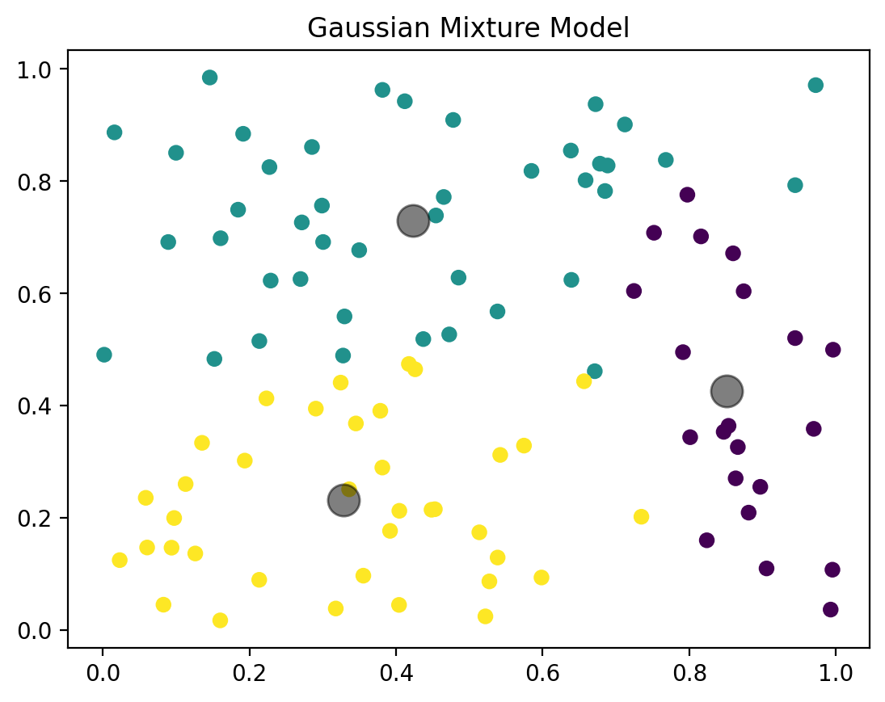
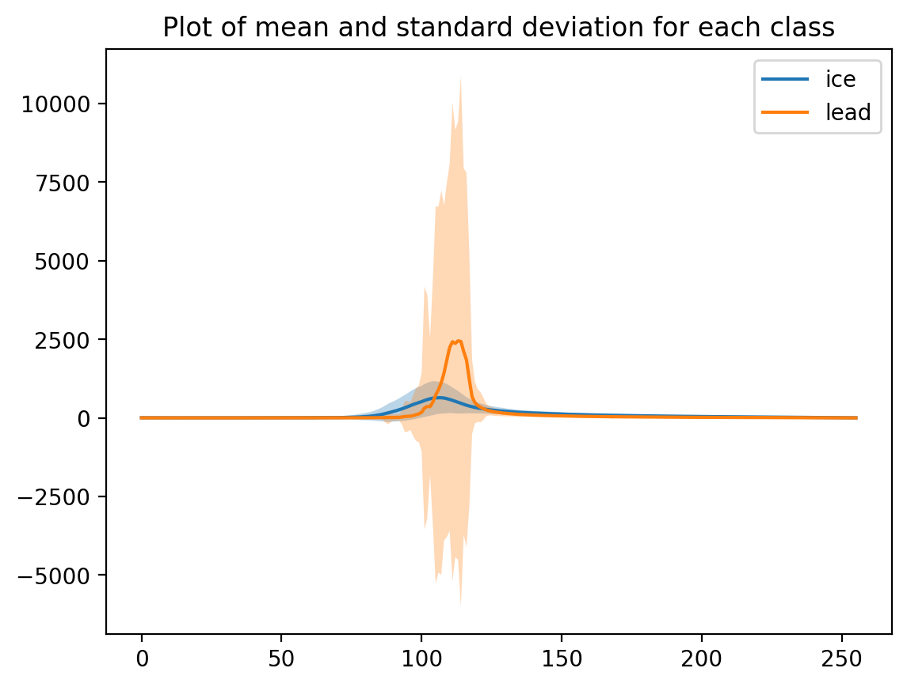

# GEOL0069_Week4

<!-- GETTING STARTED -->
## Getting Started

The Week 4 assignment for GEOL0069 Artificial Intelligence for Earth Observation focuses on applying unsupervised learning to a real Earth-observation problem: classifying Sentinel-3 SAR altimetry echoes over polar regions. Each radar measurement contains a returned “echo”  whose shape depends on surface type. In sea-ice zones, echoes can come from sea ice or from leads.  

In this project, we extract a small set of waveform-derived features, then use clustering to separate echoes into two groups. I then summarise the two classes by computing an mean echo shape and a standard deviation envelope. Finally, I evaluate how well the unsupervised clusters match the ESA official classification using a confusion matrix. 

<!-- PREREQUISITES -->
## Prerequisites

Run the notebook in Google Colab.
- Install packages
  ```sh
  !pip install netCDF4
  ```
  ```sh
  !pip install rasterio
  ```
* Mounting Google Drive on Google Colab
  ```sh
  from google.colab import drive
  drive.mount('/content/drive')
  ```

<!-- INTRODUCTION -->
## Introduction to unsupervised learning: K-means Clustering

### What K-means does
K-means is one of the most widely used unsupervised clustering algorithms and provides a clear baseline for thinking about how clustering works. The idea is to partition the dataset into K clusters such that points inside the same cluster are as similar as possible, while points in different clusters are as different as possible. It does this by learning K centroids.

### How the algorithm works
- Each observation is assigned to the closest centroid, and then the centroids are updated to be the mean of the points assigned to them. - This “assign → update” cycle repeats until assignments stop changing or a maximum number of iterations is reached.

### Strengths and limitations for altimetry echoes
- K-means is computationally efficient and easy to implement, but it has limitations that matter for geophysical data.
- It assumes clusters are roughly spherical in feature space and similar in size, and it assigns each point to exactly one cluster.
- The choice of K is also user-defined, so you must decide how many groups exist in advance. In this assignment, while K-means is useful conceptually, a probabilistic approach (GMM) can be more flexible for separating sea-ice and lead populations whose spreads may differ.

## Unsupervised Learning: Gaussian Mixture Models (GMM)

### What a GMM does
- A Gaussian Mixture Model (GMM) treats the dataset as being generated by a mixture of several Gaussian distributions (components). Unlike K-means, which uses only distances to centroids, GMM is probabilistic: each data point receives a probability of belonging to each component.
- This is useful when clusters overlap or have different shapes/spreads. Each Gaussian component has its own mean and covariance, meaning GMM can represent elongated or uneven clusters more naturally than K-means.

### Expectation–Maximization (EM) in practice
- Model parameters are learned using the Expectation–Maximization (EM) algorithm.
- In the E-step, the algorithm estimates membership probabilities for each point. In the M-step, it updates the Gaussian parameters to maximise the likelihood given those responsibilities. This iterative process continues until convergence.

### Why GMM is suitable for sea ice vs lead separation
- In this project, I use a 2-component GMM because the target separation is binary: sea ice vs lead. The input to the model is not the raw waveform but a small set of waveform-derived features.
- After fitting the GMM, each echo is assigned to one of two clusters, which are then interpreted as sea-ice or lead based on the waveform characteristics.

Below is a basic code implementation for a Gaussian Mixture Model.

```sh
from sklearn.mixture import GaussianMixture
import matplotlib.pyplot as plt
import numpy as np
import os

# Sample data
X = np.random.rand(100, 2)

# GMM model
gmm = GaussianMixture(n_components=3)
gmm.fit(X)
y_gmm = gmm.predict(X)

# Plotting
plt.scatter(X[:, 0], X[:, 1], c=y_gmm, cmap='viridis')
centers = gmm.means_
plt.scatter(centers[:, 0], centers[:, 1], c='black', s=200, alpha=0.5)
plt.title('Gaussian Mixture Model')
```



## Running the GMM Model

### Feature preparation and cleaning
- In the notebook, each echo is represented by a compact feature vector (e.g., sig0, peakiness, and SSD).
- These variables are stacked into a feature matrix and then standardised so that features with different numeric ranges contribute fairly to the clustering.
- Any rows containing NaN values are removed, and the dataset is restricted to echoes with ESA surface classes relevant to this task.

### Fitting and predicting clusters
A 2-component Gaussian Mixture Model is then fitted to the cleaned feature matrix. The trained model predicts a cluster label (0/1) for each echo, which is later interpreted as sea ice or lead by inspecting waveform shapes and comparing against ESA labels.

## Results: overview
- This section summarises the main outcomes of the unsupervised classification.
- First, we compare the average echo shape and standard deviation between the two classes.
- Next, we visualise example echoes from each class to support the interpretation of “sea ice” versus “lead”.
- We also include waveform alignment examples to show why alignment can produce cleaner class averages.
- Finally, we evaluate agreement with ESA official labels using a confusion matrix.

### Mean and Standard Deviation Echo Shape (Sea Ice vs Lead)

The means and standard deviation of the sea ice and lead echos are calculated and plotted using the code below. 

```sh
mean_ice = np.mean(waves_cleaned[clusters_gmm==0],axis=0)
std_ice = np.std(waves_cleaned[clusters_gmm==0], axis=0)

plt.plot(mean_ice, label='ice')
plt.fill_between(range(len(mean_ice)), mean_ice - std_ice, mean_ice + std_ice, alpha=0.3)


mean_lead = np.mean(waves_cleaned[clusters_gmm==1],axis=0)
std_lead = np.std(waves_cleaned[clusters_gmm==1], axis=0)

plt.plot(mean_lead, label='lead')
plt.fill_between(range(len(mean_lead)), mean_lead - std_lead, mean_lead + std_lead, alpha=0.3)

plt.title('Plot of mean and standard deviation for each class')
plt.legend()
```
- The plot below summarises the two clustered classes by showing the mean waveform for each class, together with a ±1σ standard deviation envelope. The mean provides a “typical” echo shape for the class, while the standard deviation highlights how variable echoes are within that class. In general, lead echoes tend to be more peaked and specular, while sea-ice echoes often show a broader return due to rougher scattering.
- The shaded regions are important: large standard deviation indicates high intra-class variability (e.g., differing lead widths, mixed surfaces, or small shifts in peak position). This figure is the core output of the assignment because it turns thousands of individual echoes into two interpretable summary shapes.




